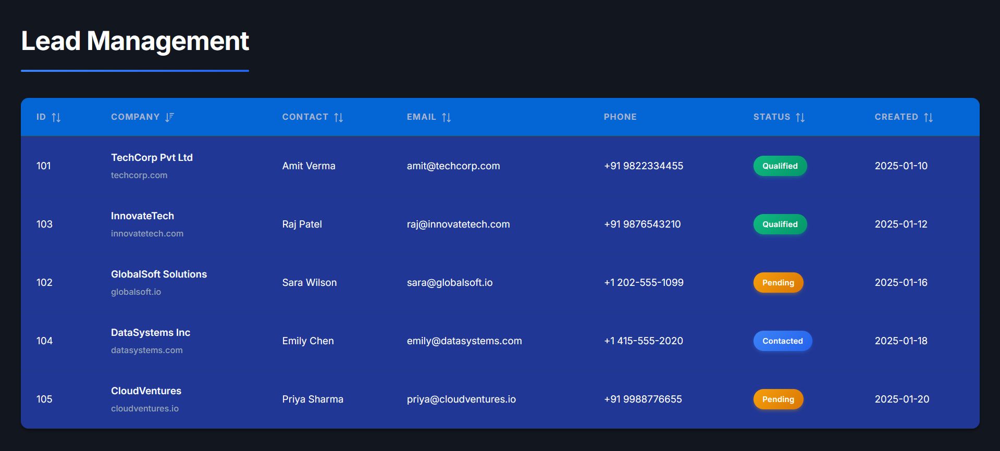

# Lead Management Dashboard

A modern React application built with Vite and PrimeReact DataTable to manage and display lead information.

## 📸 Preview



*Modern dark-themed lead management interface with sortable columns and status badges*

## 🚀 Features

- **Interactive DataTable** with sorting and pagination
- **Color-coded status badges** (Qualified, Contacted, Pending)
- **Responsive design** with modern UI
- **Modular architecture** for easy maintenance
- **Search and filter** capabilities

## 📁 Project Structure

```
Task/
├── src/
│   ├── components/          # Reusable React components
│   │   └── LeadTable.jsx    # DataTable component with templates
│   ├── data/                # Data files and constants
│   │   └── leadsData.js     # Lead records data
│   ├── App.jsx              # Main application component
│   ├── App.css              # Application styles
│   ├── main.jsx             # Application entry point
│   └── index.css            # Global styles and PrimeReact theme
├── index.html               # HTML template
├── vite.config.js           # Vite configuration
└── package.json             # Dependencies and scripts
```

## 🛠️ Tech Stack

- **React 18** - UI library
- **Vite** - Build tool and dev server
- **PrimeReact** - UI component library
- **PrimeIcons** - Icon library

## 📦 Installation

```bash
npm install
```

## 🏃 Running the Application

### Development mode
```bash
npm run dev
```
Visit http://localhost:5173/

### Build for production
```bash
npm run build
```

### Preview production build
```bash
npm run preview
```

## 🎨 Components

### LeadTable
Located in `src/components/LeadTable.jsx`

A reusable DataTable component that displays lead information with:
- Custom column templates
- Status tags with color coding
- Date formatting
- Sorting and pagination

**Props:**
- `data` - Array of lead objects

### Data Structure

Located in `src/data/leadsData.js`

Each lead object contains:
```javascript
{
  id: number,
  company: { name: string, domain: string },
  contactPerson: { firstName: string, lastName: string },
  email: string,
  phone: string,
  leadStatus: "Qualified" | "Contacted" | "Pending",
  createdAt: string (YYYY-MM-DD)
}
```

## 🎨 Customization

### Changing Theme
Edit `src/index.css` to use a different PrimeReact theme:
```css
@import url('https://unpkg.com/primereact/resources/themes/[theme-name]/theme.css');
```

Available themes: lara-light-indigo, lara-dark-indigo, md-light-indigo, etc.

### Adding New Columns
Add new `<Column>` components in `src/components/LeadTable.jsx`

### Modifying Data
Update or add new leads in `src/data/leadsData.js`

## 📄 License

MIT

